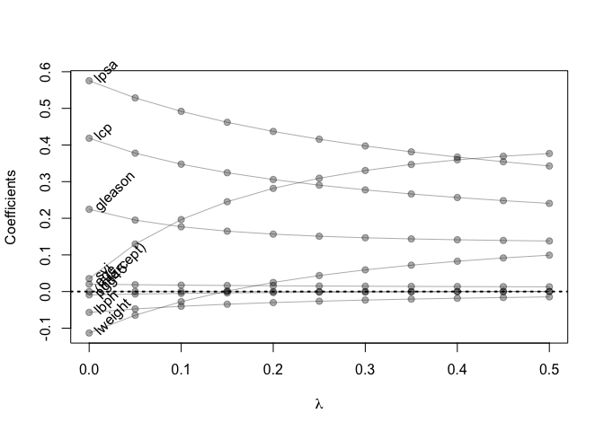

Homework 3
================
Franck Brych
2/21/2023

``` r
# load data
prostate <- 
  read.table(url(
    'https://web.stanford.edu/~hastie/ElemStatLearn/datasets/prostate.data'))
```

# Using the cor function

``` r
cor(prostate, use = 'pairwise.complete.obs')
```

    ##              lcavol      lweight       age         lbph         svi
    ## lcavol   1.00000000  0.280521380 0.2249999  0.027349703  0.53884500
    ## lweight  0.28052138  1.000000000 0.3479691  0.442264399  0.15538490
    ## age      0.22499988  0.347969112 1.0000000  0.350185896  0.11765804
    ## lbph     0.02734970  0.442264399 0.3501859  1.000000000 -0.08584324
    ## svi      0.53884500  0.155384903 0.1176580 -0.085843238  1.00000000
    ## lcp      0.67531048  0.164537142 0.1276678 -0.006999431  0.67311118
    ## gleason  0.43241706  0.056882093 0.2688916  0.077820447  0.32041222
    ## pgg45    0.43365225  0.107353785 0.2761124  0.078460018  0.45764762
    ## lpsa     0.73446033  0.433319382 0.1695928  0.179809404  0.56621822
    ## train   -0.04654347 -0.009940658 0.1776155 -0.029939957  0.02679950
    ##                  lcp     gleason      pgg45        lpsa        train
    ## lcavol   0.675310484  0.43241706 0.43365225  0.73446033 -0.046543468
    ## lweight  0.164537142  0.05688209 0.10735379  0.43331938 -0.009940658
    ## age      0.127667752  0.26889160 0.27611245  0.16959284  0.177615517
    ## lbph    -0.006999431  0.07782045 0.07846002  0.17980940 -0.029939957
    ## svi      0.673111185  0.32041222 0.45764762  0.56621822  0.026799505
    ## lcp      1.000000000  0.51483006 0.63152825  0.54881317 -0.037427296
    ## gleason  0.514830063  1.00000000 0.75190451  0.36898681 -0.044171456
    ## pgg45    0.631528246  0.75190451 1.00000000  0.42231586  0.100516371
    ## lpsa     0.548813175  0.36898681 0.42231586  1.00000000 -0.033889743
    ## train   -0.037427296 -0.04417146 0.10051637 -0.03388974  1.000000000

# treating lcavol as outcome + linear regression

``` r
p_train <- prostate %>%
  filter(train == TRUE) %>% 
  select(-train)

summary(p_train)
```

    ##      lcavol           lweight           age             lbph         
    ##  Min.   :-1.3471   Min.   :2.375   Min.   :41.00   Min.   :-1.38629  
    ##  1st Qu.: 0.4883   1st Qu.:3.330   1st Qu.:61.00   1st Qu.:-1.38629  
    ##  Median : 1.4679   Median :3.599   Median :65.00   Median :-0.05129  
    ##  Mean   : 1.3135   Mean   :3.626   Mean   :64.75   Mean   : 0.07144  
    ##  3rd Qu.: 2.3491   3rd Qu.:3.884   3rd Qu.:69.00   3rd Qu.: 1.54751  
    ##  Max.   : 3.8210   Max.   :4.780   Max.   :79.00   Max.   : 2.32630  
    ##       svi              lcp             gleason          pgg45       
    ##  Min.   :0.0000   Min.   :-1.3863   Min.   :6.000   Min.   :  0.00  
    ##  1st Qu.:0.0000   1st Qu.:-1.3863   1st Qu.:6.000   1st Qu.:  0.00  
    ##  Median :0.0000   Median :-0.7985   Median :7.000   Median : 15.00  
    ##  Mean   :0.2239   Mean   :-0.2142   Mean   :6.731   Mean   : 26.27  
    ##  3rd Qu.:0.0000   3rd Qu.: 0.9948   3rd Qu.:7.000   3rd Qu.: 50.00  
    ##  Max.   :1.0000   Max.   : 2.6568   Max.   :9.000   Max.   :100.00  
    ##       lpsa        
    ##  Min.   :-0.4308  
    ##  1st Qu.: 1.6673  
    ##  Median : 2.5688  
    ##  Mean   : 2.4523  
    ##  3rd Qu.: 3.3652  
    ##  Max.   : 5.4775

``` r
p_test <- prostate %>%
  filter(train == FALSE) %>% 
  select(-train)

summary(p_test)
```

    ##      lcavol           lweight           age             lbph        
    ##  Min.   :-0.7765   Min.   :2.865   Min.   :43.00   Min.   :-1.3863  
    ##  1st Qu.: 0.7965   1st Qu.:3.480   1st Qu.:60.00   1st Qu.:-1.3863  
    ##  Median : 1.4446   Median :3.651   Median :64.00   Median : 0.4383  
    ##  Mean   : 1.4316   Mean   :3.635   Mean   :61.90   Mean   : 0.1649  
    ##  3rd Qu.: 2.0531   3rd Qu.:3.838   3rd Qu.:67.75   3rd Qu.: 1.5728  
    ##  Max.   : 3.4720   Max.   :4.121   Max.   :70.00   Max.   : 2.1713  
    ##       svi           lcp             gleason        pgg45            lpsa       
    ##  Min.   :0.0   Min.   :-1.3863   Min.   :6.0   Min.   : 0.00   Min.   :0.7655  
    ##  1st Qu.:0.0   1st Qu.:-1.3863   1st Qu.:6.0   1st Qu.: 0.00   1st Qu.:1.8644  
    ##  Median :0.0   Median :-0.4308   Median :7.0   Median : 8.00   Median :2.5915  
    ##  Mean   :0.2   Mean   :-0.1016   Mean   :6.8   Mean   :20.17   Mean   :2.5365  
    ##  3rd Qu.:0.0   3rd Qu.: 1.0867   3rd Qu.:7.0   3rd Qu.:35.00   3rd Qu.:2.8820  
    ##  Max.   :1.0   Max.   : 2.9042   Max.   :9.0   Max.   :90.00   Max.   :5.5829

``` r
fit <- lm(lcavol ~ ., data=p_train)
summary(fit)
```

    ## 
    ## Call:
    ## lm(formula = lcavol ~ ., data = p_train)
    ## 
    ## Residuals:
    ##      Min       1Q   Median       3Q      Max 
    ## -1.71027 -0.50138  0.03103  0.51352  1.35376 
    ## 
    ## Coefficients:
    ##              Estimate Std. Error t value Pr(>|t|)    
    ## (Intercept) -2.173357   1.526699  -1.424    0.160    
    ## lweight     -0.113370   0.236639  -0.479    0.634    
    ## age          0.020102   0.013571   1.481    0.144    
    ## lbph        -0.056981   0.072525  -0.786    0.435    
    ## svi          0.035116   0.313526   0.112    0.911    
    ## lcp          0.418455   0.099521   4.205 9.16e-05 ***
    ## gleason      0.224387   0.198812   1.129    0.264    
    ## pgg45       -0.009113   0.005451  -1.672    0.100 .  
    ## lpsa         0.575455   0.107235   5.366 1.47e-06 ***
    ## ---
    ## Signif. codes:  0 '***' 0.001 '**' 0.01 '*' 0.05 '.' 0.1 ' ' 1
    ## 
    ## Residual standard error: 0.7116 on 58 degrees of freedom
    ## Multiple R-squared:  0.7118, Adjusted R-squared:  0.672 
    ## F-statistic:  17.9 on 8 and 58 DF,  p-value: 3.999e-13

``` r
coef(fit)
```

    ## (Intercept)     lweight         age        lbph         svi         lcp 
    ## -2.17335699 -0.11336968  0.02010188 -0.05698125  0.03511645  0.41845469 
    ##     gleason       pgg45        lpsa 
    ##  0.22438690 -0.00911273  0.57545508

``` r
residuals(fit)
```

    ##           1           2           3           4           5           6 
    ##  0.30510051 -0.36214995 -0.31372527 -0.57604668  1.00855250 -0.80121337 
    ##           8          11          12          13          14          16 
    ##  0.93154303 -0.04430734 -1.45525306  1.00784627  0.84369636  1.05697269 
    ##          17          18          19          20          21          23 
    ## -1.07296621  1.10894970 -0.58433985 -0.20987943  0.73401898 -0.96212934 
    ##          24          27          29          30          31          33 
    ##  0.60155186  0.08773062  0.30844179  0.46587959 -0.39203706  0.51616536 
    ##          35          37          38          39          40          41 
    ## -1.00794601 -1.08327905 -0.58060313  0.68114682 -0.52751225 -0.16747733 
    ##          43          45          46          47          51          52 
    ## -0.46010692  0.15965010  0.70751569  0.13993772  0.20829842  0.83814762 
    ##          56          58          59          60          61          63 
    ##  0.30174358 -0.21418255 -0.61609540  0.27427103 -0.59282089  0.37445320 
    ##          67          68          69          70          71          72 
    ##  0.20410928  0.51088167 -1.71027355 -0.30736902 -0.18635786 -0.24666610 
    ##          75          76          77          78          79          81 
    ##  0.03553988  0.23104706  0.17458591  0.89281112 -0.27734203 -0.62839982 
    ##          82          83          85          86          87          88 
    ## -0.06963027  0.03103464 -0.65441115  0.38724844  0.66414753 -0.63266711 
    ##          89          90          91          92          93          94 
    ## -0.25266290 -0.87963313  1.35375660  0.70838106 -0.13844098  0.62802337 
    ##          96 
    ## -0.47525498

# testing error and loss function

``` r
L2_loss <- function(y, yhat)
  (y-yhat)^2
error <- function(dat, fit, loss=L2_loss)
  mean(loss(dat$lcavol, predict(fit, newdata=dat)))

# testing error
error(p_test, fit)
```

    ## [1] 0.5084068

# ridge regression model using glmnet

``` r
form  <- lcavol ~  lweight + age + lbph + lcp + pgg45 + lpsa + svi + gleason
x_inp <- model.matrix(form, data=p_train)
y_out <- p_train$lcavol
fit <- glmnet(x=x_inp, y=y_out, lambda=seq(0.5, 0, -0.05),alpha=0)
print(fit$beta)
```

    ## 9 x 11 sparse Matrix of class "dgCMatrix"

    ##    [[ suppressing 11 column names 's0', 's1', 's2' ... ]]

    ##                                                                    
    ## (Intercept)  .             .             .             .           
    ## lweight      0.0993164708  9.167566e-02  0.0826683948  0.0719539791
    ## age          0.0129153943  1.324527e-02  0.0136179441  0.0140406458
    ## lbph        -0.0145798645 -1.634009e-02 -0.0183250211 -0.0206075810
    ## lcp          0.2406189663  2.481045e-01  0.2566365965  0.2662889674
    ## pgg45        0.0002559092 -6.282802e-05 -0.0004352183 -0.0008738898
    ## lpsa         0.3427088262  3.542773e-01  0.3670625828  0.3813402190
    ## svi          0.3767521726  3.693591e-01  0.3595330020  0.3468674180
    ## gleason      0.1379543516  1.394770e-01  0.1413173561  0.1436779615
    ##                                                                             
    ## (Intercept)  .            .            .            .            .          
    ## lweight      0.059127616  0.043652593  0.024777969  0.001504802 -0.027603986
    ## age          0.014526957  0.015088490  0.015748487  0.016532948  0.017480107
    ## lbph        -0.023258103 -0.026377963 -0.030098852 -0.034621150 -0.040241264
    ## lcp          0.277447149  0.290342311  0.305728439  0.324372008  0.347616547
    ## pgg45       -0.001398912 -0.002031353 -0.002810371 -0.003788173 -0.005050263
    ## lpsa         0.397429712  0.415786556  0.437009864  0.461951799  0.491849702
    ## svi          0.330415198  0.309283880  0.281608260  0.245177911  0.196427346
    ## gleason      0.146778188  0.150949425  0.156678907  0.164800413  0.176722769
    ##                                      
    ## (Intercept)  .            .          
    ## lweight     -0.064680201 -0.113137304
    ## age          0.018643148  0.020098181
    ## lbph        -0.047425776 -0.056962692
    ## lcp          0.377657417  0.418431830
    ## pgg45       -0.006739814 -0.009116838
    ## lpsa         0.528596455  0.575318051
    ## svi          0.129711598  0.035342349
    ## gleason      0.194999807  0.224585243

# showing training/test error for ridge

``` r
error <- function(dat, fit, lam, form, loss=L2_loss) {
  x_inp <- model.matrix(form, data=dat)
  y_out <- dat$lcavol
  y_hat <- predict(fit, newx=x_inp, s=lam)  ## see predict.elnet
  mean(loss(y_out, y_hat))
}
err_train_1 <- sapply(fit$lambda, function(lam) 
  error(p_train, fit, lam, form))
err_test_1 <- sapply(fit$lambda, function(lam) 
  error(p_test, fit, lam, form))

## plot test/train error
plot(x=range(fit$lambda),
     y=range(c(err_train_1, err_test_1)),
     xlim=rev(range(fit$lambda)),
     type='n',
     xlab=expression(lambda),
     ylab='train/test error')
points(fit$lambda, err_train_1, pch=19, type='b', col='darkblue')
points(fit$lambda, err_test_1, pch=19, type='b', col='darkred')
legend('topright', c('train','test'), lty=1, pch=19,
       col=c('darkblue','darkred'), bty='n')
```

<!-- -->

# path diagram

``` r
plot(x=range(fit$lambda),
     y=range(as.matrix(fit$beta)),
     type='n',
     xlab=expression(lambda),
     ylab='Coefficients')
for(i in 1:nrow(fit$beta)) {
  points(x=fit$lambda, y=fit$beta[i,], pch=19, col='#00000055')
  lines(x=fit$lambda, y=fit$beta[i,], col='#00000055')
}
text(x=0, y=fit$beta[,ncol(fit$beta)], 
     labels=rownames(fit$beta),
     xpd=NA, pos=4, srt=45)
abline(h=0, lty=3, lwd=2)
```

<!-- -->
