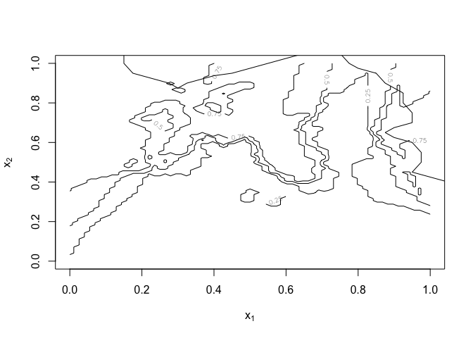

Homework 1
================
Franck Brych
2022-10-14

``` r
library('class')
library('dplyr')
```

    ## 
    ## Attaching package: 'dplyr'

    ## The following objects are masked from 'package:stats':
    ## 
    ##     filter, lag

    ## The following objects are masked from 'package:base':
    ## 
    ##     intersect, setdiff, setequal, union

``` r
## load binary classification example data from author website 
## 'ElemStatLearn' package no longer available
load(url('https://web.stanford.edu/~hastie/ElemStatLearn/datasets/ESL.mixture.rda'))
dat <- ESL.mixture
```

# HW –

``` r
plot_mix_data <- function(dat, datboot=NULL) {
  if(!is.null(datboot)) {
    dat$x <- datboot$x
    dat$y <- datboot$y
  }
  plot(dat$x[,1], dat$x[,2],
       col=ifelse(dat$y==0, 'blue', 'orange'),
       pch=20,
       xlab=expression(x[1]),
       ylab=expression(x[2]))
  ## draw Bayes (True) classification boundary
  prob <- matrix(dat$prob, length(dat$px1), length(dat$px2))
  cont <- contourLines(dat$px1, dat$px2, prob, levels=0.5)
  rslt <- sapply(cont, lines, col='purple')
}

plot_mix_data(dat)
```

<!-- -->

``` r
data <- data.frame(y = dat$y, x1 = dat$x[,1], x2 = dat$x[,2])
fit_lc <- lm(y~x1+x2, data = data)
lc_pred <- predict(fit_lc, newdata = data.frame(dat$xn))

## reshape predictions as a matrix
lc_pred <- matrix(lc_pred, length(dat$px1), length(dat$px2))
contour(lc_pred,
      xlab=expression(x[1]),
      ylab=expression(x[2]))
```

<!-- -->

``` r
## find the contours in 2D space such that lc_pred == 0.5
lc_cont <- contourLines(dat$px1, dat$px2, lc_pred, levels=0.5)

## plot data and decision surface
plot_mix_data(dat)
sapply(lc_cont, lines)
```

<!-- -->

    ## [[1]]
    ## NULL

``` r
plot_mix_data <- expression({
  plot(dat$x[,1], dat$x[,2],
       col=ifelse(dat$y==0, 'blue', 'orange'),
       pch=20,
       xlab=expression(x[1]),
       ylab=expression(x[2]))
  ## draw Bayes (True) classification boundary
  prob <- matrix(dat$prob, length(dat$px1), length(dat$px2))
  cont <- contourLines(dat$px1, dat$px2, prob, levels=0.5)
  rslt <- sapply(cont, lines, col='purple')
})

data = data.frame(y = dat$y, x1 = dat$x[,1], x2 = dat$x[,2])
fit_lm = lm(y~poly(x1,2)+poly(x2,2),data = data)
lm_pred = predict(fit_lm, newdata = data.frame(dat$xnew))
## reshape predictions as a matrix
lm_pred <- matrix(lm_pred, length(dat$px1), length(dat$px2))
contour(lm_pred,
      xlab=expression(x[1]),
      ylab=expression(x[2]))
```

<!-- -->

``` r
## find the contours in 2D space such that lc_pred == 0.5
lm_cont <- contourLines(dat$px1, dat$px2, lm_pred, levels=0.5)

## plot data and decision surface
eval(plot_mix_data)
sapply(lm_cont, lines)
```

<!-- -->

    ## [[1]]
    ## NULL

# Short answer

Bias, in this case, is the distance of our prediction from the true
value that we want to predict. Variance in our case is the variability
of our prediction. To create a robust model, there must be a good
balance between variance and bias. Squaring the terms in our model
increased the variance and decreased bias. \#–

``` r
## fit linear classifier
fit_lc <- function(y, x) {
  x <- cbind(1, x)
  beta <- drop(solve(t(x)%*%x)%*%t(x)%*%y)
  dat <- data.frame(y=y, x=x)}


## make predictions from linear classifier
predict_lc <- function(x, beta) {
  cbind(1, x) %*% beta
}
```

``` r
## fit model to mixture data and make predictions
lc_beta <- fit_lc(dat$y, dat$x)
#lc_pred <- predict_lc(dat$xnew, lc_beta)

## reshape predictions as a matrix
#lc_pred <- matrix(lc_pred, length(dat$px1), length(dat$px2))
#contour(lc_pred,
      #xlab=expression(x[1]),
      #ylab=expression(x[2]))


## find the contours in 2D space such that lc_pred == 0.5
#lc_cont <- contourLines(dat$px1, dat$px2, lc_pred, levels=0.5)

## plot data and decision surface
#plot_mix_data(dat)
#sapply(lc_cont, lines)
```

``` r
## fit knn classifier
## use 5-NN to estimate probability of class assignment
knn_fit <- knn(train=dat$x, test=dat$xnew, cl=dat$y, k=5, prob=TRUE)
knn_pred <- attr(knn_fit, 'prob')
knn_pred <- ifelse(knn_fit == 1, knn_pred, 1-knn_pred)

## reshape predictions as a matrix
knn_pred <- matrix(knn_pred, length(dat$px1), length(dat$px2))
contour(knn_pred,
        xlab=expression(x[1]),
        ylab=expression(x[2]),
        levels=c(0.25, 0.5, 0.75))


## find the contours in 2D space such that knn_pred == 0.5
knn_cont <- contourLines(dat$px1, dat$px2, knn_pred, levels=0.5)

## plot data and decision surface
#plot_mix_data(dat)
sapply(knn_cont, lines)
```

<!-- -->

    ## [[1]]
    ## NULL
    ## 
    ## [[2]]
    ## NULL
    ## 
    ## [[3]]
    ## NULL
    ## 
    ## [[4]]
    ## NULL
    ## 
    ## [[5]]
    ## NULL

\`\`\`
